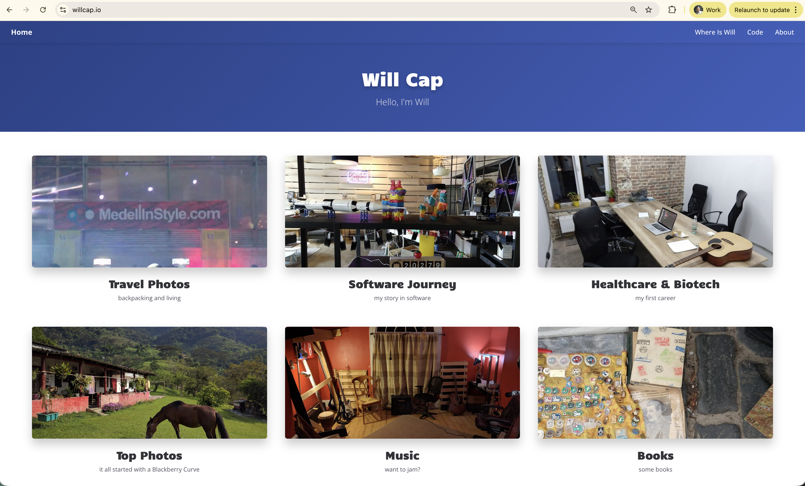
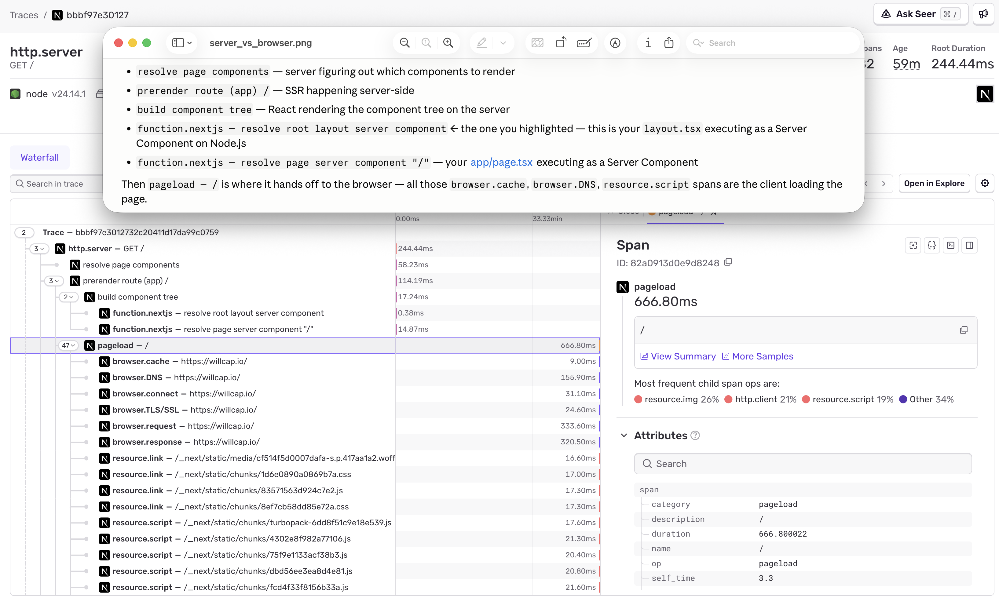
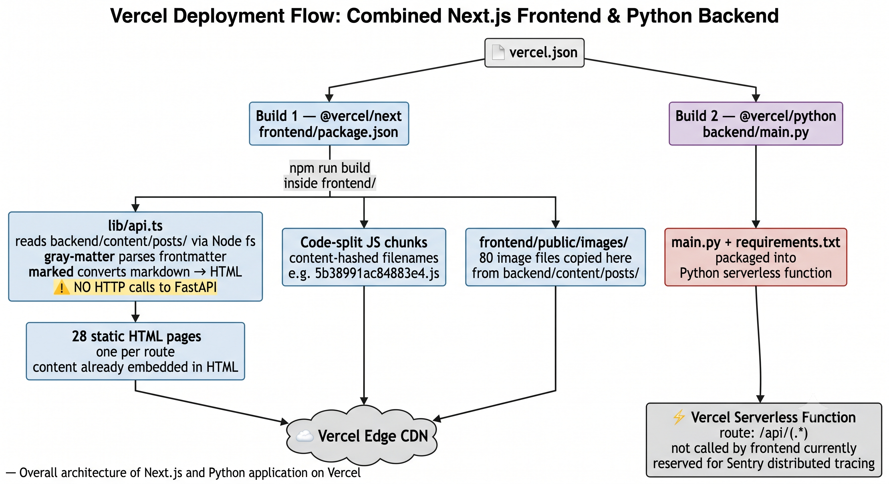
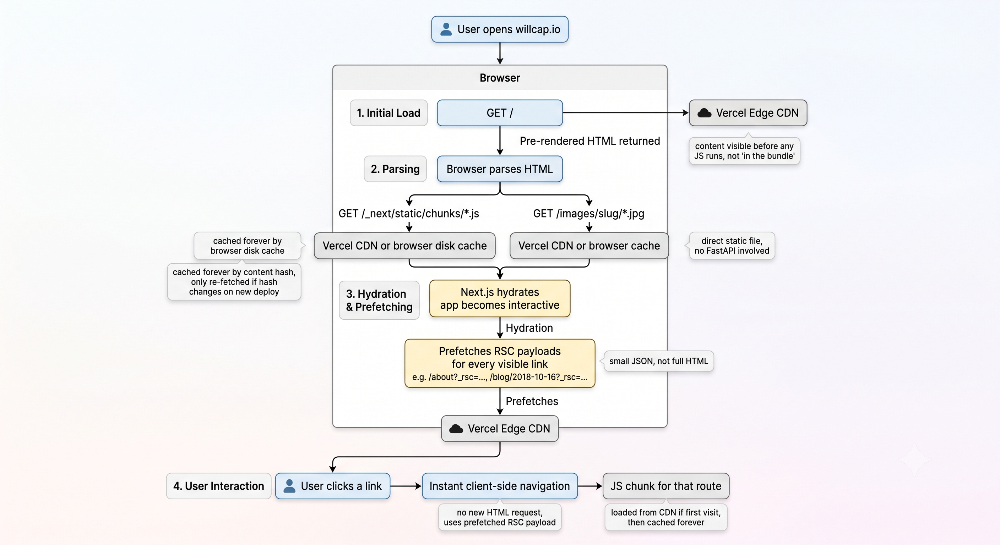

# WillCap.io

&nbsp;

[](https://nextjs.org/)
[](https://fastapi.tiangolo.com/)
[](https://www.typescriptlang.org/)
[](https://www.python.org/)
[](https://vercel.com)

A modern personal blog built with Next.js and FastAPI, featuring markdown-based content, tag filtering, and responsive design.

### Timeline

2026 May 30 - revisited how everything works. images-cdn PR and documentation.  
2026 May 22 - ran new Next/FastAPI app. removed old gatsby files, removed redundant readme markdowns. soon deploy to Vercel.

## ✨ Features

- 📝 **Markdown Blog Posts** - Write posts in markdown with frontmatter
- 🏷️ **Tag System** - Organize and filter posts by tags
- 🖼️ **Image Support** - Optimized image handling and serving
- 📱 **Responsive Design** - Mobile-first, works on all devices
- ⚡ **Fast Performance** - Static generation with incremental updates
- 🔍 **SEO Optimized** - Built-in metadata and Open Graph support
- 🎨 **Modern UI** - Clean design with CSS Modules
- 🚀 **Easy Deployment** - Optimized for Vercel

## 🏗️ Architecture

```
┌─────────────────────────────────────────┐
│              Vercel                     │
├─────────────────────────────────────────┤
│  Next.js Frontend  ◄──►  FastAPI Backend│
│  (React + TypeScript)   (Python)        │
└─────────────────────────────────────────┘
```

- **Frontend**: Next.js 14+ with App Router and TypeScript
- **Backend**: FastAPI serving blog content via REST API
- **Deployment**: Vercel with automatic HTTPS and global CDN

### Build Time



### Runtime



## 🚀 Quick Start

### Prerequisites

- Node.js 18+
- Python 3.11+
- npm or yarn

### One-Command Start

```bash
./start-dev.sh
```

This starts both the frontend and backend servers. Visit:
- **Frontend**: http://localhost:3000
- **Backend API**: http://localhost:8000
- **API Docs**: http://localhost:8000/docs

### Manual Start

**Backend:**
```bash
cd backend
python3 -m venv venv
source venv/bin/activate  # Windows: venv\Scripts\activate
pip install -r requirements.txt
uvicorn main:app --reload
```

**Frontend:**
```bash
cd frontend
npm install
npm run dev
```

QUICK-START.md for more details.

## 📁 Project Structure

```
willcapio-old/
├── frontend/           # Next.js application
│   ├── app/           # App Router pages
│   ├── components/    # React components
│   ├── lib/           # Utilities (API, theme)
│   └── public/        # Static assets
│
├── backend/           # FastAPI application
│   ├── main.py       # API server
│   ├── content/      # Markdown blog posts
│   └── requirements.txt
│
└── vercel.json       # Deployment configuration
```

## 🛠️ Tech Stack

### Frontend Components
React components are in `frontend/components/` with CSS Modules for styling.

### Theme Colors
Edit `frontend/lib/theme.ts` to change colors, fonts, and styles.

### Backend
- FastAPI
- Python Markdown
- Frontmatter parsing
- Uvicorn (ASGI server)

### 📊 API Endpoints

| Endpoint | Description |
|----------|-------------|
| `GET /api/posts` | List all blog posts |
| `GET /api/posts/{slug}` | Get single post |
| `GET /api/tags` | Get all tags |
| `GET /api/posts/tag/{tag}` | Filter by tag |
| `GET /api/site-config` | Site configuration |
| `GET /docs` | API documentation |

### API
All API logic is in `backend/main.py`. Easy to extend with new endpoints. Much of this is only used during build time.

## 📝 Adding Blog Posts

1. Create a new directory in `backend/content/posts/`:
   ```bash
   mkdir backend/content/posts/name-of-post
   ```

2. Create `index.md` with frontmatter:
   ```markdown
   ---
   title: "Name of Post"
   date: "2024-12-19"
   tags: ["tech", "blog"]
   cover: "./cover-image.jpg"
   ---
   
   Your post content here...
   ```

3. Add images to the same directory. May need to add the post to frontend/public/images with its images.

## 🌐 Deployment

see DEPLOYMENT.md

### Environment Variables

Set `NEXT_PUBLIC_API_URL` in Vercel:
- Development: `http://localhost:8000`
- Production: `https://your-domain.vercel.app`

## 📖 Documentation / How This Works

- **[Quick Start Guide](QUICK-START.md)** - Get up and running fast
- **[Deployment Guide](DEPLOYMENT.md)** - Deploy to Vercel
- **[Project Overview](PROJECT-OVERVIEW.md)** - Full technical overview
- **[Migration Summary](MIGRATION-SUMMARY.md)** - What was changed (originally built with Gatsby v2 and migrated to Next.js and FastAPI)

The reason you're only seeing :8000 image calls in the Network tab is because the text/post data calls happen server-side — Next.js fetches from the API at build/render time on the server (note next: { revalidate: 3600 } in lib/api.ts), so they never appear in the browser's network inspector. Only the image src URLs embedded in the rendered HTML end up making client-side requests to :8000.

Both pages use force-static, meaning Next.js calls the FastAPI backend at build time (npm run build), bakes all the post data into static HTML files, and serves those pre-rendered pages. So:

When you hit localhost:3000 for the first time, the HTML you get back already contains all the text — no API call happens in the browser at all
generateStaticParams() on the blog page means every post slug is also pre-rendered to its own static HTML page at build time
The :8000 image calls you see in the Network tab are the only runtime requests, because image URLs are embedded as src attributes and the browser fetches those client-side
The FastAPI backend only needs to be running during npm run build (or when Next.js revalidates after 1 hour). In production you'd need the backend running continuously for revalidation, but the page loads themselves are just static file serving.

First deploy to Vercel failed...I think the vercel functions serving images, weren't working. so updated app to find them locally on filesystem. then that broke local running, even though Vercel deploy worked:

The images are requesting localhost:3000/images/... but FastAPI is on localhost:8000. Locally, Next.js doesn't proxy /images/* to FastAPI — that routing only exists in vercel.json for Vercel. Fix is to add a dev rewrite in next.config.ts.

Edited
next.config.ts
+15
-0
This proxies /images/* and /api/* to FastAPI at localhost:8000 in dev only. On Vercel, vercel.json handles the routing instead.

Make sure FastAPI is running (cd backend && uvicorn main:app --reload), then restart the Next.js dev server and the images should load. Want me to commit and push this fix too?

### Is this a SPA?
A true SPA loads a single blank HTML shell upfront and JavaScript renders everything — the server never sends actual page content, just a JS bundle that builds the UI in the browser.

Next.js with force-static works differently:

First visit to any URL → server sends fully pre-rendered HTML with content already in it (not a blank shell). The browser can display it before any JS runs.
After hydration → Next.js takes over and subsequent navigation is client-side, like a SPA
So it's a hybrid — static HTML for first load, SPA-like for subsequent navigation. The distinction matters for:

SEO — crawlers see real content in the HTML, not a blank page waiting for JS
Performance — first paint is fast because content is in the HTML
The RSC prefetch requests you saw — a pure SPA wouldn't have those because it would already have all the JS needed to render every route
Gatsby worked the same way. If it were a pure SPA, you'd see a nearly empty index.html and one large JS bundle doing all the work. Instead each route has its own pre-rendered HTML file on Vercel's CDN.

### thing
The fix is straightforward: move the images to frontend/public/images/ so Vercel serves them directly from its CDN, bypassing FastAPI entirely. The image paths in api.ts already use /images/${slug}/filename — Next.js automatically serves anything in public/ at /, so no code changes needed. Then remove the /images/* route from vercel.json.

## 🧭 Sessions (Custom Session Tracing)

This app models a **user session as a single Sentry trace**: one long-lived root
span (`op: session`, typically seconds-to-minutes long) with one child span per
page (`op: ui.page`, spanning page-enter → page-leave). Time-on-page, ordering,
and journey context live as span **attributes** (`session.id`, `page`, `from`,
`step`, `dwell_ms`) because spans are indexed and easily queryable. A few
aggregate rollups are also emitted as custom metrics at each span stop
(`page.dwell`, `session.duration`, `session.pages`).

Implementation:
- `frontend/lib/sessionTrace.ts` — the session engine (start/end, page spans, metrics)
- `frontend/components/SessionTracker.tsx` — mounted once in `app/layout.tsx`, drives enter/leave off route changes

### Single narrative — navigation auto-instrumentation is OFF

So the session trace is the *one* story of a journey, we disabled the SDK's
default per-navigation traces — otherwise every client-side page change spawns
its own trace and fragments the journey into many disconnected traces. In
`instrumentation-client.ts`:

- `Sentry.browserTracingIntegration({ instrumentNavigation: false })`
- `onRouterTransitionStart` is intentionally **not** exported (that hook is what
  starts the SDK's App Router navigation spans).

The initial page-load trace is kept (`instrumentPageLoad`, on by default) for
load performance (LCP/FCP/TTFB) — that's one trace at session start, not per-page noise.

### Why a session STARTS

A new session begins on the first of these to occur:

- **The SDK is initialized** and the first page is entered (initial page load).
- **The page/tab is resumed** (becomes visible again) and no current session is
  recorded — most likely because the previous session ended when they navigated
  away / switched tabs. In other words, **returning to the original tab starts a
  brand-new session** (by design — the prior session already flushed when they left).
- Any page navigation while no session is currently active (e.g. after an idle timeout).

### Why a session ENDS

A session ends — and *only then* is its trace flushed to Sentry — on:

| What the user does | Event fired | Session ends? |
|---|---|---|
| Switch to another tab / minimize / switch app / lock phone | `visibilitychange → hidden` | **Instantly** ✓ |
| Close the tab / navigate to another site | `pagehide` (backstop) | **Instantly** ✓ |
| Stays on one page, tab visible, stops interacting | idle timer | after timeout |
| Tab crash / force-kill / power loss | *none* | **Never — trace is lost** ⚠️ |

The last row is inherent to this model: a trace only flushes when its root span
ends, so if the JS context dies without warning, `session.end()` never runs and
that session is lost. Every *graceful* exit (the common cases) is covered by
`visibilitychange` + `pagehide`.

> Note: because the trace only appears once the session ends, a live session shows
> nothing in Sentry until it's over. Great for demos (do a journey, leave, then
> open the finished trace) — just know it isn't live-streaming.

### Idle timer — note for reviewers

The idle timeout defaults to **30 minutes since the last page change** (`IDLE_MS`
in `sessionTrace.ts`). Note this is "since the last navigation," not true
inactivity — a reader who stays on one long page for 30 min would have their
session ended mid-read. To make it *real* inactivity, one could also reset the
idle timer on user activity (`pointerdown` / `keydown` / `scroll`) — a small,
self-contained change. It's left **unimplemented on purpose** so anyone reviewing
this Session Tracing can decide that trade-off for themselves; for now we keep it simple.

## 🧪 Testing

```bash
# Test the API
./test-api.sh

# Test frontend build
cd frontend && npm run build
```

## 🔒 Security

- ✅ CORS properly configured
- ✅ Environment variables for configuration
- ✅ No sensitive data in code
- ✅ HTTPS on Vercel

## 📈 Performance

- ⚡ Static Site Generation (SSG)
- 🔄 Incremental Static Regeneration (ISR)
- 🖼️ Optimized image loading
- 🌍 Global CDN distribution
- 📱 Mobile-first responsive design

## 🤝 Contributing

This is a personal blog, but feel free to fork and adapt for your own use!

## 📄 License

MIT

## 🧭 Session Tracing — Three Techniques & Trade-offs

There are three ways to shape how the session/trace data is captured. The
**session-tracking PR (#7)** shipped **Option A**.

### Option A — Current (shipped in PR #7)

The session trace is a clean **journey skeleton**: a `session` root span with one
`ui.page` child per page (`dwell_ms` / `from` / `step` as span attributes). The
SDK's default per-navigation traces are disabled so the journey isn't fragmented;
the initial-load `pageload` trace is kept (a *separate* trace) for load performance.

**Q3: What span ops did we give up by disabling navigation?**

On client-side route changes we no longer capture:

| Lost op (on navigation) | What it was |
|---|---|
| `navigation` | the per-route root transaction |
| `resource.script` / `resource.link` / `resource.css` / `resource.img` / `resource.other` | JS chunks, CSS, images loaded for the new route |
| `http.client` | fetch/XHR — including Next's RSC data fetches |
| `browser.request` / `browser.response` | browser timing for the navigation |
| `ui.long-task` / `ui.long-animation-frame` | main-thread jank during the route change |
| `ui.webvital.cls` / `ui.webvital.lcp` (+ INP/FCP/TTFB) | Web Vitals attributed to the navigation |

Note: these still fire on the **initial load** (they hang off the kept `pageload`
trace). But because our session spans are `startInactiveSpan`, none of these auto
spans land *inside* the session trace — it stays a skeleton.

### Option B — Make the `ui.page` span active

Run each `ui.page` span as the **active** span for the route's lifetime, so
auto-instrumentation nests *inside* it: `http.client`, `resource.*`, and (with
`Sentry.withProfiler`) `ui.react.mount` / `ui.react.update`. Result: one rich,
deep session trace. Cost: managing an active span across React's async lifecycle
and Next navigations — higher implementation complexity/risk.

### Option C — Re-enable navigation + link by `session.id`

Keep the `session` trace as the journey narrative **and** re-enable per-navigation
traces for page-level depth, stitched together by a shared `session.id`. Two
complementary *views* (journey-level + page-level). Lowest implementation risk,
but the most trace instances per journey (`pageload` + `session` + one
`navigation` per route change).