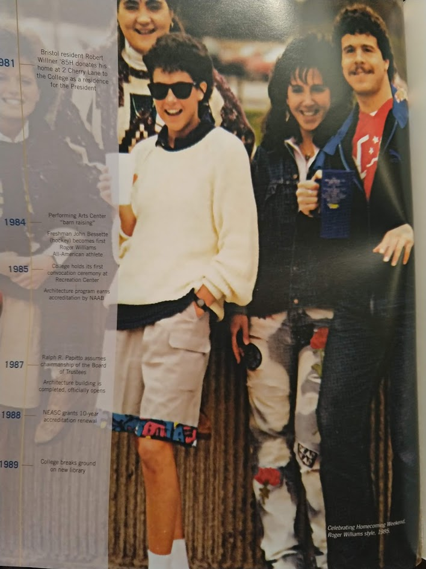

<!-- institutions I studied in. courses I took -->
You can take the kid out of Walpole, but you can't take Walpole out of the kid.                

**2010** *Roger Williams University* B.S. Biology

**2015** *Fullstack Academy* Web Development Immersive

**2016** *Harvard Extension School* Java for Distributed Programming & Hadoop

**2017** *Consensys* Academy Developer Program for Ethereum Programming

**2019** *Harvard Extension School* Principles of Big Data Processing  

A picture from my alma mater RWU
