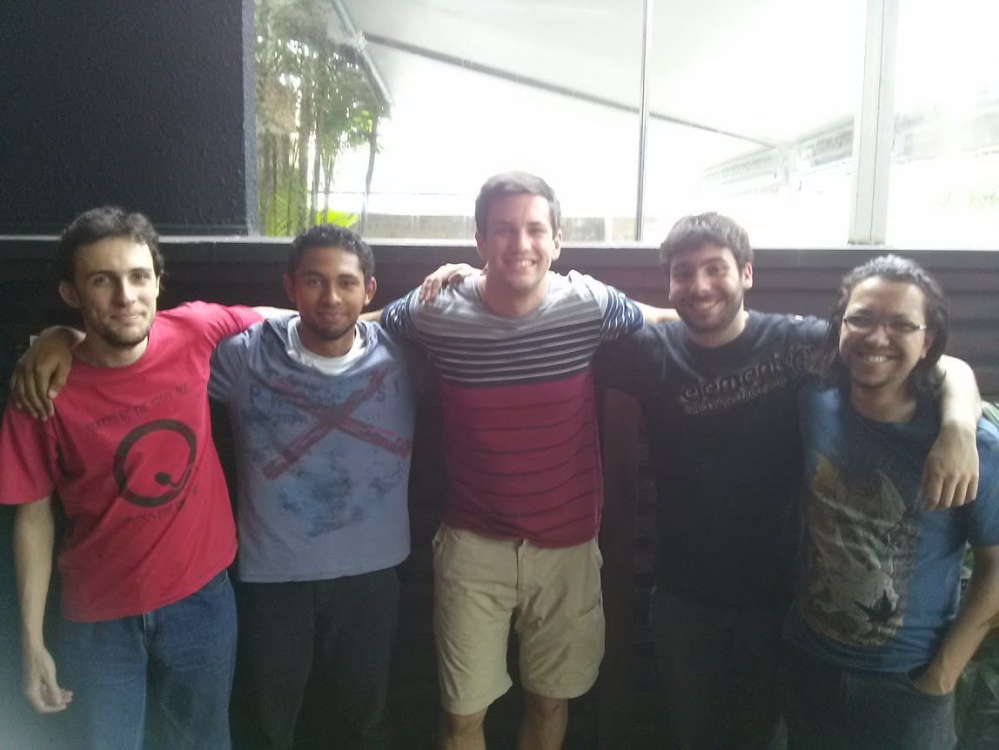

The storyy.                        

**2014** I started programming in C++ as a hobby. I enjoyed the feeling of creativty and power to fix things myself. My day job felt more like I was consulting and acting as a secretary, coordinating fixes across teams, always waiting for approval from higher-ups, but never actually fixing anything myself. 

*With people*, you have to wait 24-48 hours for a response to the emails you send them.  
*With code*, the computer responds right away.

**2015** I started programming in javascript full-time by leaving my job and moving to Brazil:

I got an internship at Educare.com.br with these guys:  

**2015** I left Brazil to attend Fullstack Academy (NYC) to go from amateur to professional developer. I learned to make super useful things:

**2016** I got my first job as a Software Developer, at a Biotech Company in Boston. I developed web services to support R&D of mRNA therapeutic drugs.

**2018** I worked for two web development agencies as a contractor, and did much of this remotely while travelling:

Co-working space in Lviv:

**2019** I moved to San Francisco to join Sentry.io as a Sales Engineer.

