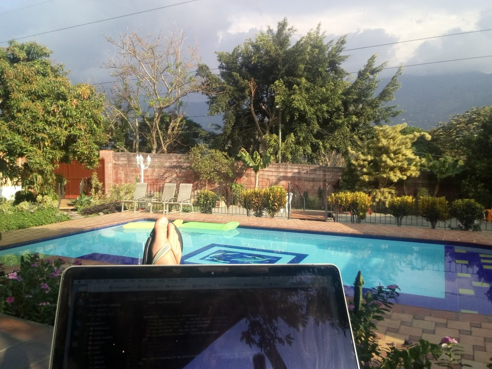
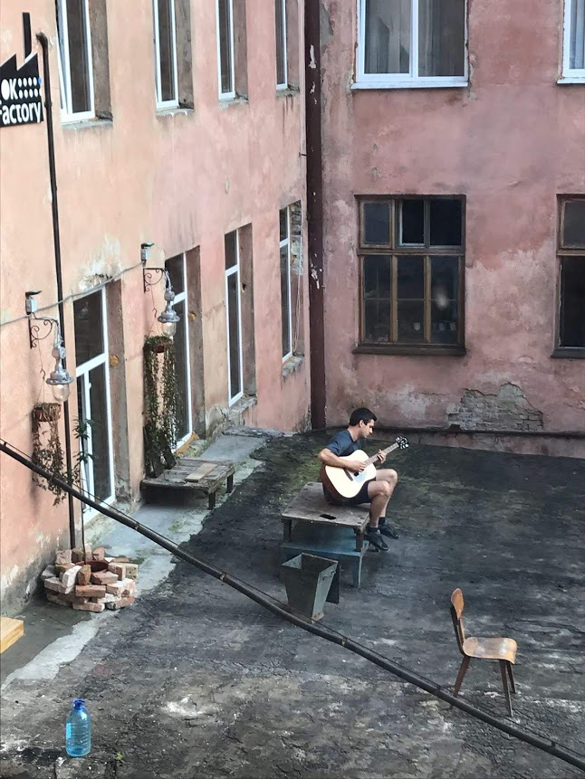
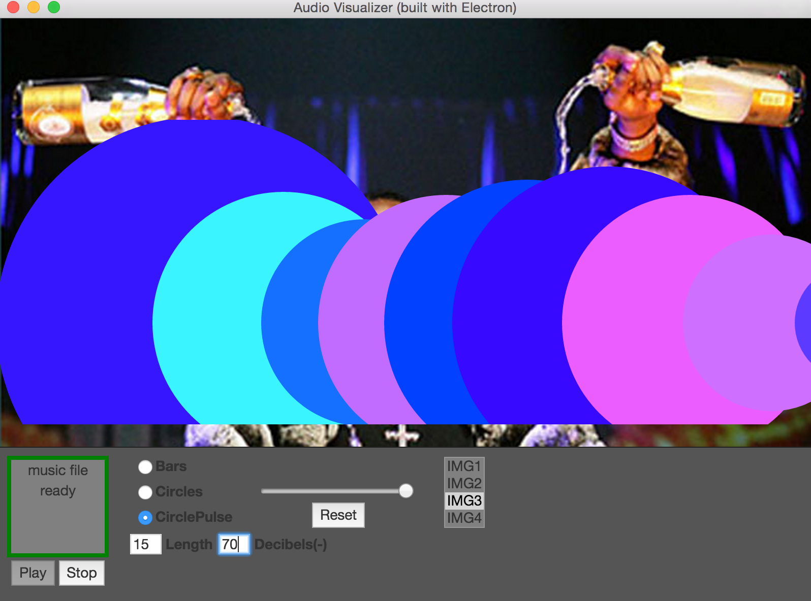

**2022** I moved to Vienna, Austria to continue working for Sentry as a Sales Engineer.
      
**2019** I moved to San Francisco to join Sentry.io as a Sales Engineer.

**2018** I quit the full-time job to try workling remotely while traveling (pre-Covid). I worked for two web development agencies as a contractor.

Working from Colombia:

Working from a Co-working space in Lviv:

**2016** I got my first job as a Software Developer, at a Biotech Company in Boston. I developed web services to support R&D of mRNA therapeutic drugs.

**2015** I attended Fullstack Academy (NYC) to go from hobbyist to junior developer.

**2015** I started programming in javascript full-time by leaving my job and moving to Brazil. I got an internship an ed-tech company using PHP Cake. Me in my home office:

**2014** I tried programming in C++ for fun. I enjoyed the feeling of creativty and power to fix things myself. I didn't have to send emails and wait around for responses and ping managers to get things done. I felt less like a middleman and felt like I was fixing things myself. With people you have to wait 24-48 hours for a response to the emails you send them. With code the computer responds right away.
