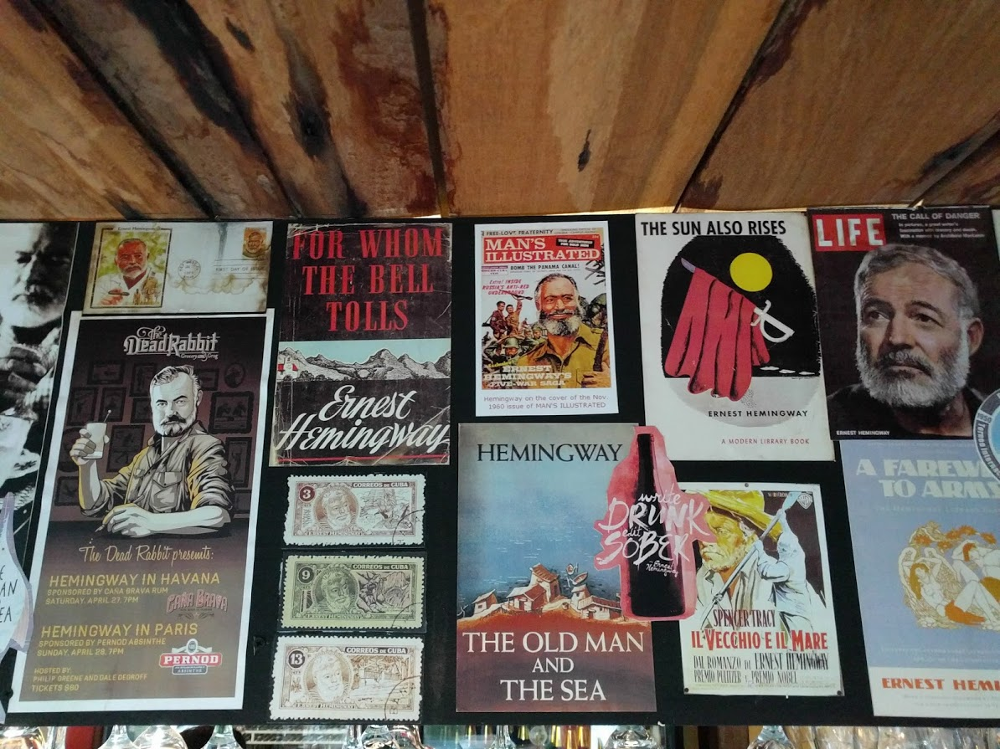

Books I've read and literary observations.                                                 

#### 2020
How The West Won: The Neglected Story of The Triumph of Modernity by Rodney Stark

#### 2019
Alchemy of Finance by George Soros

Soros on Soros by George Seoros

Sons of Wichita: How the Koch Brothers Became America's Most Powerful and Private Dynasty by Daniel Schuman

Devil's Bargain by Joshua Green

Ben Franklin: An American Life by Walter Isaacson

#### 2018
My Beloved World by Sonia Sotomayor 

Ted Cruz A Time For Truth: Reigniting The Promise of America

Ben Franklin - Autobiography

The Art of Happiness by Dalai Lama

#### 2017
The McKinsey Way by Ethan Rasiel

The Lords of Strategy, The Secret Intellectual History of the New Corporate World by Walter Kiechel

#### < 2016
The Jew Who was Ukrainian by Alexander J. Motyl

Steve Jobs: A Biography by Walter Isaacson

Tearing Down The Walls: Sandy Weill by Monica Langley

The Battle of Bretton Woods by Benn Stell

Che Guevara: A Revolutionary Life by Jon Lee Anderson

#### Next
Bhagavad Gita

On My Country and the World by Mikhail Gorbachev

Liberalism: The Life of an idea by Edmun Fawcett

The Arab Uprising what everyone needs to know by James Gelvin

The Revolution: A Manifesto by Ron Paul

Autobiography of Malcolm X

A Literary Education and Other Essays - Joseph Epstein

Capital in the Twenty-First Century by Thomas Piketty

#### Favorite Writer
it's a tie between Christopher Hitchens and this guy:

*"If you tried to do the things you said you'd do when you were drunk, it'd teach you to keep your mouth shut"* E.H.
