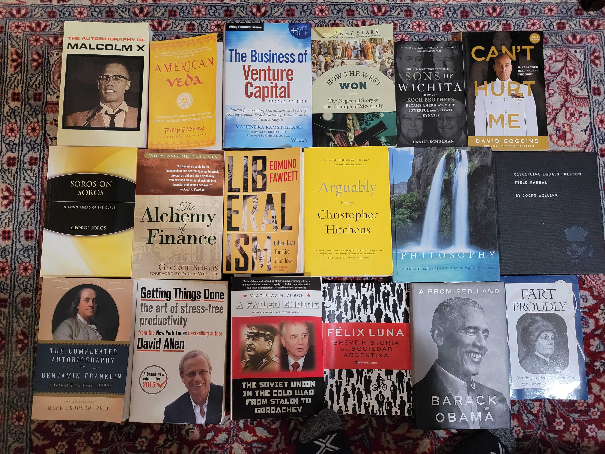

Some books I've read                                                                                               

| Title  | Author |
| ------------- | ------------- |
| **2022** | |
| A Failed Empire: The Soviet Union in the Cold War from Stalin to Gorbachev  | Vladislav Zubok  |
| **2021** | |
| American Veda  | Philip Goldberg |
| Liberalism: The Life of an idea | Edmun Fawcett |
| Discipline Equals Freedom  | Jocko Willink  |
| A Promised Land | Barack Obama |
| **2020** | |
| How The West Won: The Neglected Story of The Triumph of Modernity  | Rodney Stark |
| Autobiography of Malcolm X | Malcolm X & Alex Haley |
| The Business of Venture Capital | Mahendra Ramsinghani |
| Can't Hurt Me | David Goggins |
| **2019** | |
| Alchemy of Finance  | George Soros  |
| Soros on Soros | George Soros |
| Sons of Wichita: How the Koch Brothers Became America's Most Powerful and Private Dynasty | Daniel Schuman |
| Devil's Bargain: Steve Bannon, Donald Trump, and the Nationalist Uprising | Joshua Green |
| Ben Franklin: An American Life | Walter Isaacson |
| **2018** | |
| My Beloved World | Sonia Sotomayor |
| The Autobiography of Ben Franklin | Ben Franklin |
| The Art of Happiness | Dalai Lama |
| A Time For Truth: Reigniting The Promise of America | Ted Cruz |
| **2017** | |
| The McKinsey Way | Ethan Rasiel
| The Lords of Strategy, The Secret Intellectual History of the New Corporate World | Walter Kiechel |
| The Jew Who was Ukrainian | Alexander J. Motyl |
| Hitch-22: A Memoir | Christopher Hitchens |
| **2016** | |
| Steve Jobs: A Biography | Walter Isaacson |
| Tearing Down The Walls: Sandy Weill | Monica Langley |
| The Battle of Bretton Woods | Benn Stell |
| Che Guevara: A Revolutionary Life | Jon Lee Anderson |
| Letters to a Young Contrarian | Christopher Hitchens |
| Zen and the Art of Motorcycle Maintenance: An Inquiry into Values | Robert M Pirsig |

## A Favorite Writer
it's a tie between Christopher Hitchens and Ernest Hemingway who said,

*"If you tried to do the things you said you'd do when you were drunk, it'd teach you to keep your mouth shut"*
