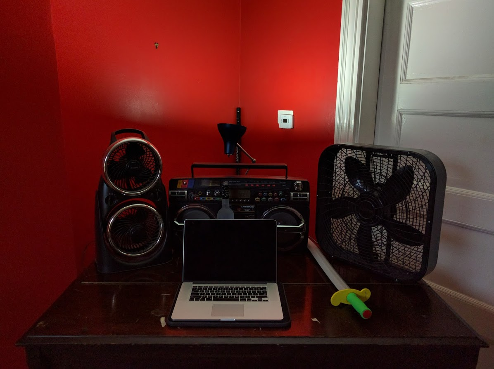
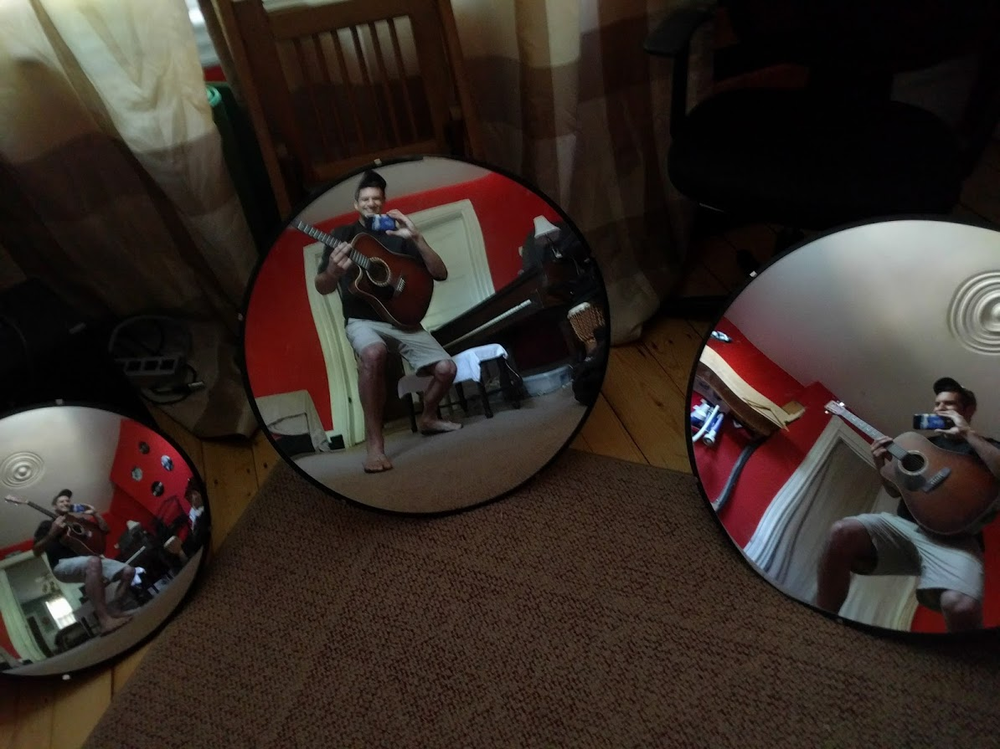
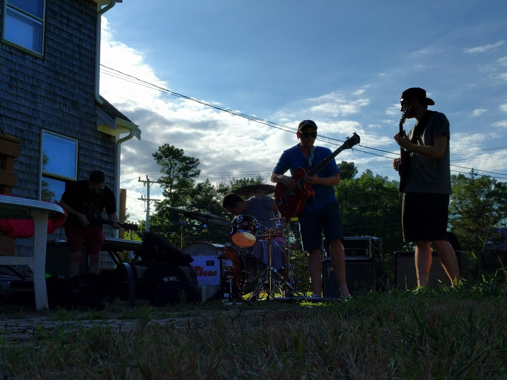
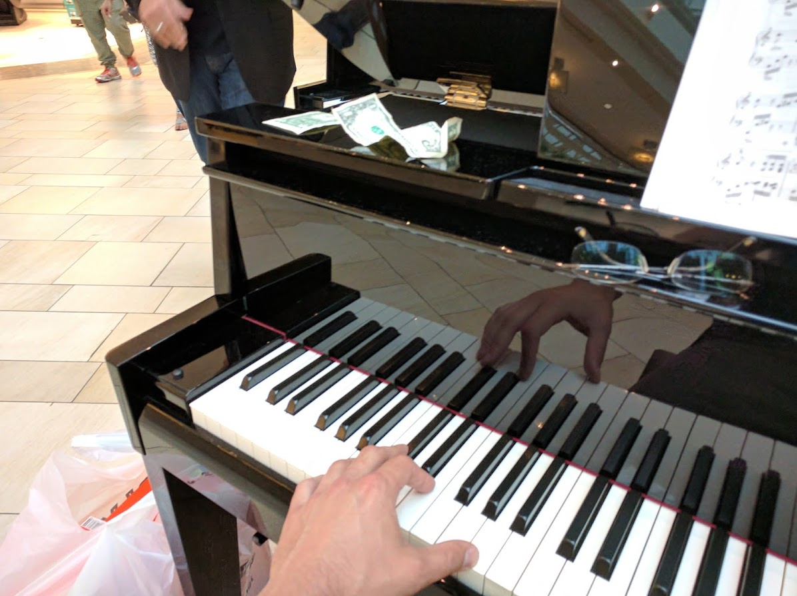
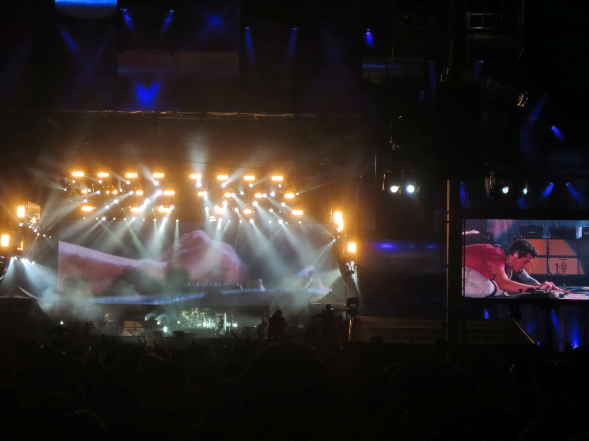

The ways music intersects and shapes my life.                                       

# Music
Let's get serious

Like really serious

Like I'll find a house party for your band, as I did in Cape Cod:

Or I'll get people to put money down on a piano at the mall, from gently playing seventh chords on it.

And get 42 Upvotes on Reddit for recording this GIF of the crowd waves at a Rage Against The Machine:
https://www.reddit.com/r/RATM/comments/frbrcy/gif_of_crowd_jumping_at_ratm_battle_of_santiago/

I saw John Mayer play in Rio De Janeiro (Rock in Rio, 2013)
