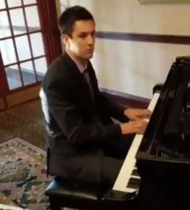
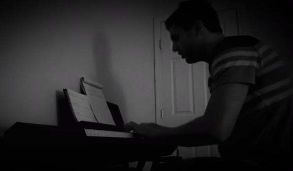
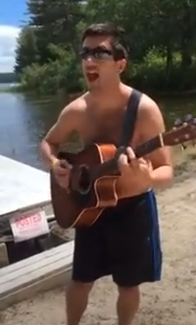

The way music intersects and shapes my life.                                       

# Music
Let's get serious

Like really serious

I'll throw a house party for your band like I did in Cape Cod:

Or I'll get people to put money down when I play piano at the mall.

I saw John Mayer play in Rio De Janeiro (2013).

I play piano at weddings.  
https://www.youtube.com/watch?v=dZC7f8x3M_I

I sing Kendrick Lamar (Wesley's Theory)  
https://www.youtube.com/watch?v=2fmnkEQCPhA

I sing originals too (Running In The Forest)  
https://www.youtube.com/watch?v=pON8E6F_XeY  

I got 42 upvotes on Reddit for recording this GIF of the crowd wave at a Rage Against The Machine concert  
https://www.reddit.com/r/RATM/comments/frbrcy/gif_of_crowd_jumping_at_ratm_battle_of_santiago/
