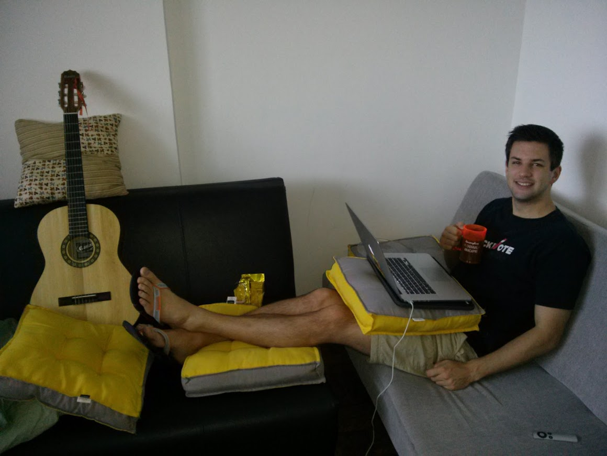
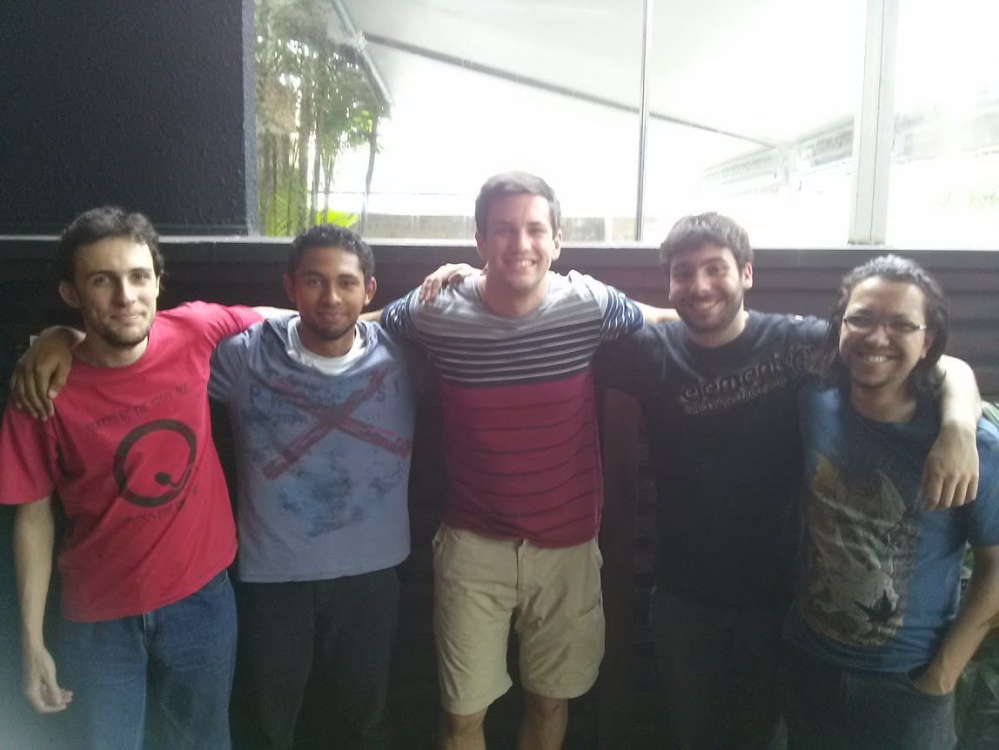
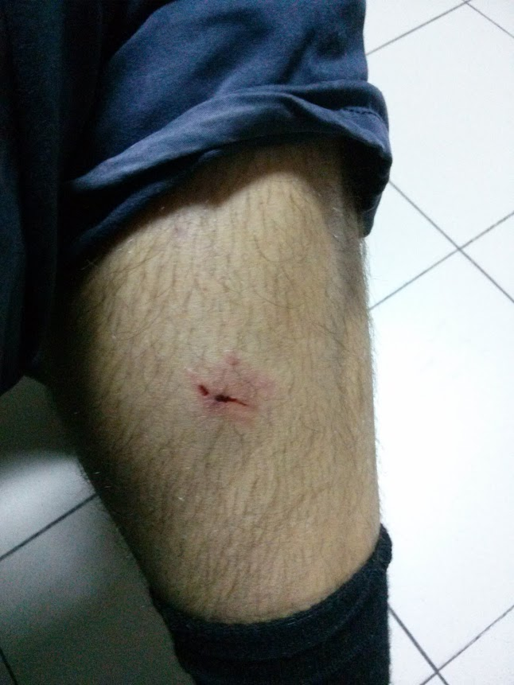
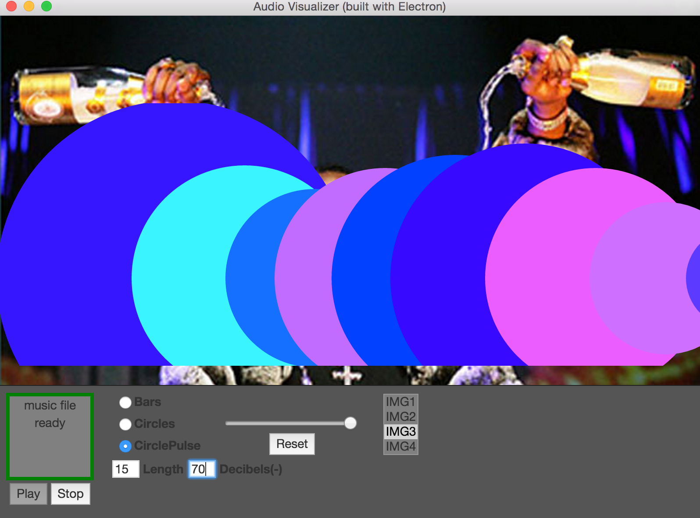
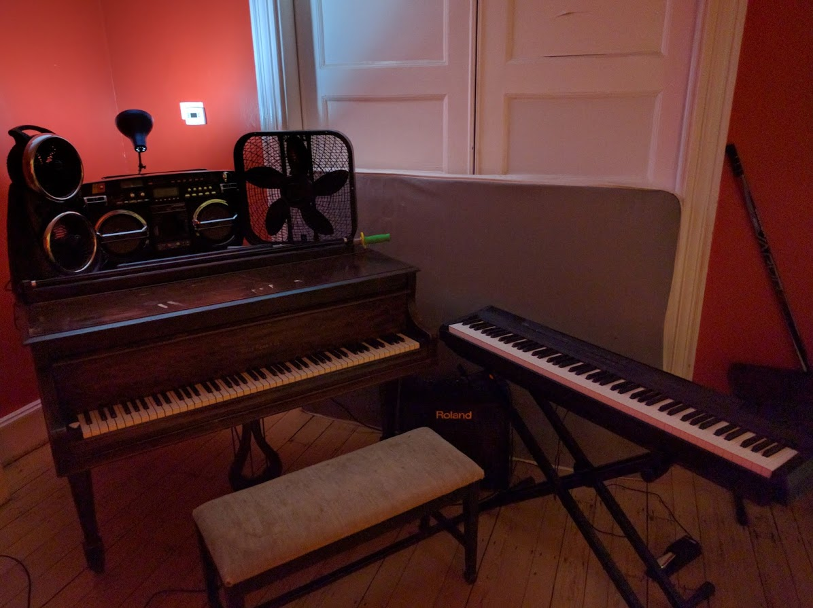
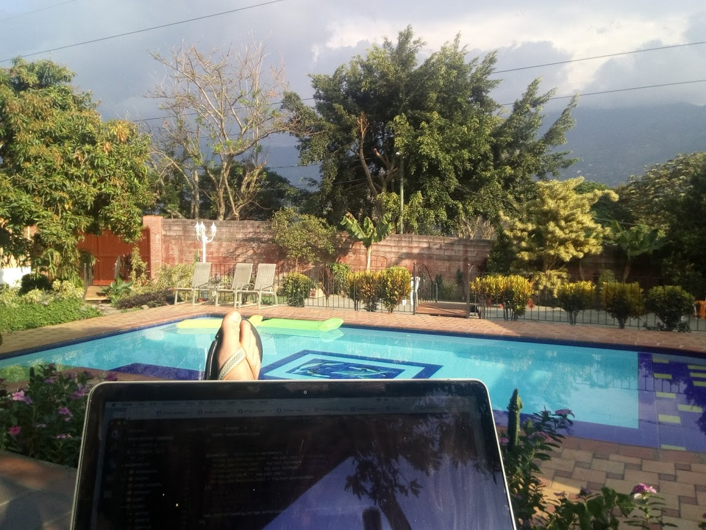
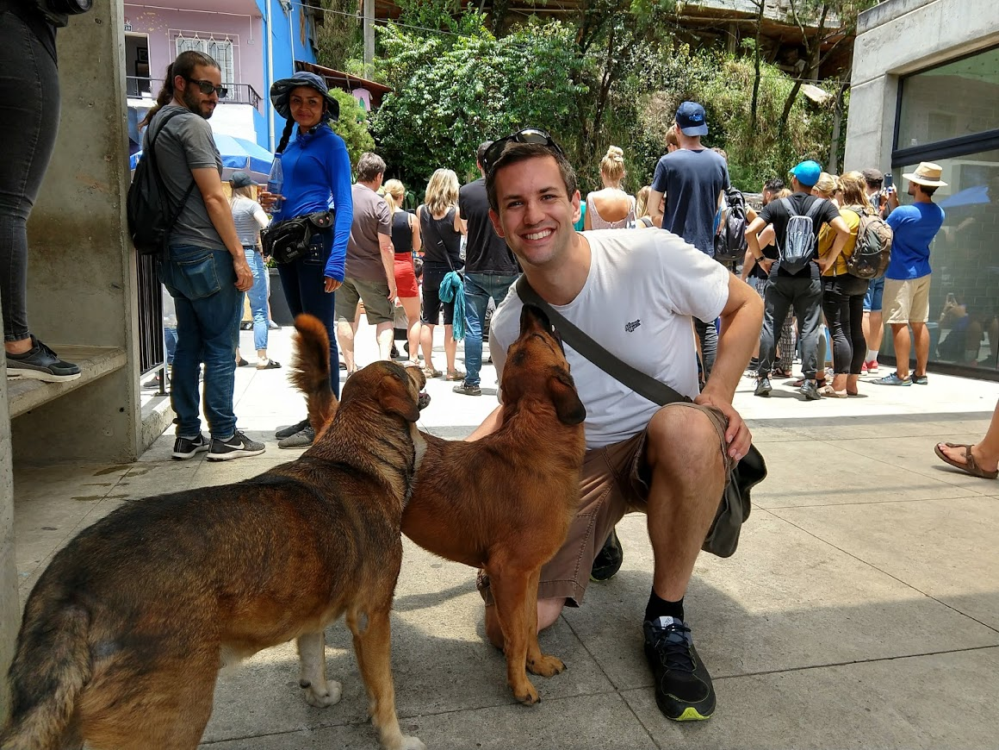
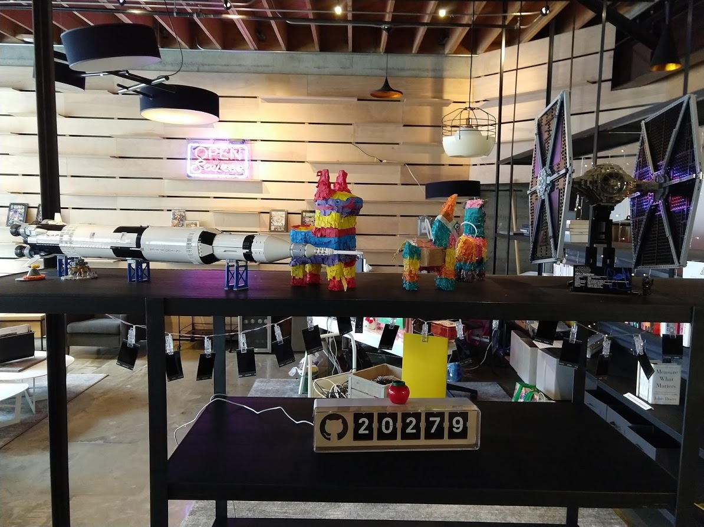

The story of why and how I started to code, and the places it's taken me.             

**2014** I started programming in C++ as a hobby. I enjoyed the feeling of creativty and power to fix things myself. I realized I was lacking this in my other jobs such as Consulting, where I felt like I was essentially a secretary cross-coordinating lots of teams, always waiting for approval and direction from managers. While the work I did was valuable and it solved problems, it left me feeling like I was never fixing things myself.

*With people*, you have to wait 24-48 hours for a response to the emails you send them.  
*With code*, the computer responds right away. This is much more efficient than dealing with humans. It felt great.

**2015** I started programming in javascript full-time by leaving my job and moving to Brazil:

I got an internship at Educare.com.br with these guys:  

and was bit by a dog when I was skateboarding in Argentina:

I'm never afraid to take one for the team:

**2015** I left Brazil to attend Fullstack Academy (NYC) to go from amateur to professional developer. I learned to make super useful things:

**2016** I got my first job as a Software Developer, at a Biotech Company. I developed web services to support R&D of mRNA therapeutic drugs, and played music in Boston:

**2018** I worked for two web development agencies as a contractor, and did much of this remotely while travelling:

I got along with Colombian dogs:

And took Slavic breaks:

**2019** Sales Engineer at Sentry.io  

and wrote this bash script to make ASCII art and play music:  
https://github.com/thinkocapo/bash-party-scripting
among other things I've built there for Sales:  
https://github.com/thinkocapo/undertaker
https://github.com/sentry-demos/kubernetes
https://github.com/sentry-demos/tracing  
https://github.com/thinkocapo/golang-grpc  
