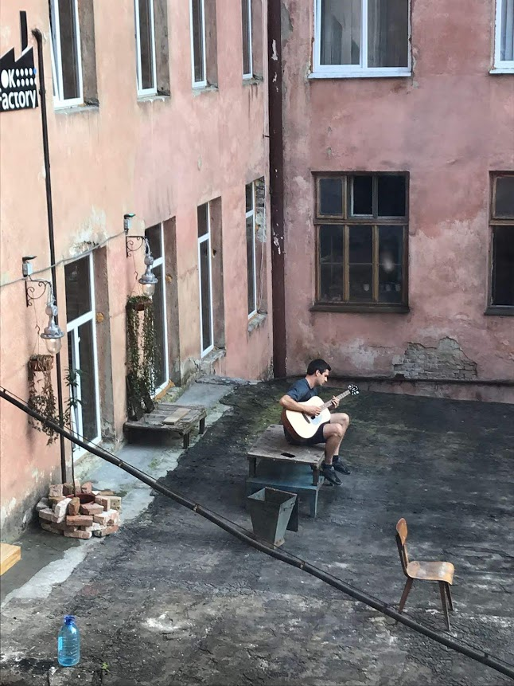

The story of why and how I started to code, and the places it's taken me.             

**2014** started programming in C++ as a hobby  
**2015** started programming in javascript full-time by leaving my job and moving to Brazil:

Got an internship at Educare.com.br with these guys:  

And bit by a dog when I was skateboarding in Argentina:


I'm never afraid to take one for the team:


**2015** I left Brazil to attend Fullstack Academy (NYC) to go from amateur to professional developer. I learned to make super useful things:


**2016** 1st Software Developer job at Biotech Company. I developed web services to support R&D of mRNA therapeutic drugs and played music in Cambridge:


**2018** I worked for two web development agencies as a contractor, and did much of this remotely while travelling:

I got along with Colombian dogs:

And took Slavic breaks:



**2019** Sales Engineer at Sentry.io  


and wrote this bash script to make ASCII art and play music:  
https://github.com/thinkocapo/bash-party-scripting
```bash
...
run() {
        play_music
        strobe_light
}
run
```

among other things:  
https://github.com/thinkocapo/event-maker  
https://github.com/sentry-demos/kubernetes  
https://github.com/thinkocapo/golang-grpc  
